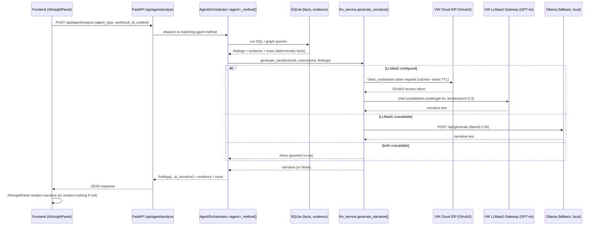

# LegacyIQ Architecture Overview

## System Architecture Diagram

```
┌─────────────────────────────────────────────────────────────────────┐
│                        USER BROWSER                                 │
│                    (http://localhost:3000)                          │
└────────────────────────────┬──────────────────────────────────────┘
                             │
                    React Frontend
                    ┌─────────────────┐
                    │   React + TS    │
                    │   8 Pages       │
                    │   Tailwind UI   │
                    │   3D Graph      │
                    │   (three.js)    │
                    └────────┬────────┘
                             │
                        ┌────▼────────┐
                        │  Axios API  │
                        │   Client    │
                        └────┬────────┘
                             │
                   HTTP REST API (Port 8000)
                             │
     ┌───────────────────────┴──────────────────────┐
     │                                              │
     ▼                                              ▼
FastAPI Backend ◄────────────────────────────► SQLite Database
(Port 8000)      HTTP (REST + JSON)            (one file per workbook)
│                                                │
├─ /api/workbook/*                             ├─ applications
├─ /api/agent/*                                ├─ code_modules
├─ /api/dependency-graph/*                     ├─ business_rules
├─ /api/traceability/*                         ├─ dependencies
└─ /health                                     ├─ data_stores
                                               ├─ integrations
                                               ├─ test_cases
                                               ├─ modernization_backlog
                                               ├─ documentation_artifacts
                                               └─ risks (computed on demand, not persisted)
```

## System Components

### 1. Frontend Layer (React/TypeScript)
```
Frontend (Vite + React + TypeScript)
├── Pages (8 main)
│   ├── UploadPage - XLSX ingestion interface
│   ├── DashboardPage - Command center with pipeline (clickable metric/coverage cards)
│   ├── UnderstandPage - Estate analysis (app-filterable Modules/Rules tabs)
│   ├── DocumentPage - Documentation generation (application selector)
│   ├── DependencyMapPage - Interactive 3D graph (application selector, upstream/downstream)
│   ├── ParityLabPage - Parity test results (pass/fail/mismatch)
│   ├── ModernizationPage - Strategy & recommendations (application selector)
│   └── TraceabilityPage - Audit trail viewer (applications/modules/rules/dependencies)
├── Components
│   └── Navigation - Main navigation bar
├── Context
│   └── WorkbookContext - Active workbook, persisted to localStorage
├── Types
│   └── TypeScript interfaces (types/index.ts)
└── Utils
    └── API client with Axios (utils/api.ts)
```

### 2. API Layer (FastAPI)
```
FastAPI Backend (Python)
├── Workbook Management (7 endpoints)
│   ├── POST /api/workbook/upload
│   ├── GET /api/workbook/{id}/metadata
│   ├── GET /api/workbook/{id}/applications
│   ├── GET /api/workbook/{id}/modules?app_id=...
│   ├── GET /api/workbook/{id}/dependencies
│   ├── GET /api/workbook/{id}/business-rules
│   └── GET /api/workbook/{id}/documentation-artifacts
├── Analysis Endpoints (5 endpoints)
│   ├── POST /api/agent/analyze
│   ├── POST /api/dependency-graph/analyze
│   ├── GET /api/workbook/{id}/dashboard-summary
│   ├── GET /api/workbook/{id}/risks
│   └── POST /api/traceability/trace
└── Infrastructure
    ├── GET /health
    ├── CORS middleware
    └── Error handling
```

### 3. Service Layer (Business Logic)
```
Analysis & Processing Services

XLSXIngestionService (backend/app/services/xlsx_ingestion.py)
├── ingest_workbook()
├── _extract_sheet_data()
├── _store_sheet_data()          # column-name-exact + _find_column_value() fallback
├── _create_schema()
├── _find_column_value()          # case/spacing-tolerant column lookup
└── Data retrieval methods (get_applications, get_modules, get_documentation_artifacts, ...)

AnalysisEngine (backend/app/services/analysis_engine.py)
├── build_dependency_graph()      # seeds every entity as a node so true orphans are detectable
├── generate_dashboard_summary()  # real per-stage completion metrics
├── identify_risks()              # 10 risk rules, computed fresh every call
└── build_trace_chain()           # application / module / rule / dependency / risk / recommendation

AgentOrchestrator (6 Agents, same file)
├── legacy_archaeologist_analyze()
├── documentation_architect_generate()   # accepts application_id in context
├── dependency_detective_analyze()
├── parity_engineer_generate()           # normalizes parity_status → pass/mismatch/pending
├── modernization_strategist_recommend() # priority P1-P4, effort_points, preserves_continuity
└── security_continuity_guardian_detect()
```

### 4. Data Layer (SQLite)
```
Database Schema (Normalized, one .db file per workbook: backend/data/cache/workbook_{id}.db)

Tables (9):
├── applications
│   └── app_id, app_name, primary_language, platform, business_domain,
│       criticality, annual_maint_cost_eur, last_deployed, owner, doc_coverage_pct
├── code_modules
│   └── module_id, app_id, module_name, module_type, lines_of_code,
│       cyclomatic_complexity, is_dead_code, has_unit_tests, description_present
├── business_rules
│   └── rule_id, module_id, rule_summary, business_domain, criticality,
│       extraction_confidence, duplicate_of, has_test_case
├── dependencies
│   └── dependency_id, source_module_id (source_id), target_type, target_id,
│       dependency_kind (relationship_type), is_runtime_critical → criticality
├── data_stores
│   └── store_id, store_name, store_type, owning_app_id, classification,
│       pii_present, record_count_est
├── integrations
│   └── integration_id, app_id, interface_name, integration_type, direction,
│       protocol, downstream_target, status, last_verified
├── test_cases
│   └── test_id, rule_id, module_id, test_name, test_type,
│       expected_result, legacy_result, parity_status → status
├── modernization_backlog
│   └── backlog_id, app_id, module_id, recommendation, target_tech,
│       effort_points, risk_level, preserves_continuity, priority, status
└── documentation_artifacts
    └── doc_id, app_id, doc_type, doc_title, last_updated, author, excerpt

All tables include:
├── source_sheet - Which XLSX sheet
├── source_row - Which row in sheet
└── trace_id - Unique trace identifier

Risks are NOT a table — they're computed fresh from the tables above on every
GET /risks or /traceability/trace(finding_type="risk") call.
```

## Data Flow Architecture

```
1. UPLOAD & INGEST
   XLSX File → FastAPI /upload
              ↓
   Column-aware extraction (exact match + _find_column_value fallback)
              ↓
   SQLite Storage (with trace metadata)

2. ANALYSIS & PROCESSING
   SQLite Data → Analysis Engine
                ├→ Coverage & Pipeline Metrics
                ├→ Risk Identification (10 rules)
                ├→ Graph Construction (seeded with every entity, not just edges)
                └→ Trace Building
                ↓
   Agent Orchestrator
   ├→ Legacy Archaeologist
   ├→ Documentation Architect       (application-scoped)
   ├→ Dependency Detective
   ├→ Parity Engineer
   ├→ Modernization Strategist      (application-scoped recommendations)
   └→ Security & Continuity Guardian
                ↓
   Findings + Evidence + Trace

3. DELIVERY TO FRONTEND
   REST API Responses
        ↓
   React Components (with client-side application filters where useful)
        ↓
   User Dashboard & Analysis
```

## Processing Pipeline

```
UNDERSTAND           DOCUMENT           MAP                TEST              MODERNIZE
   │                   │                 │                  │                   │
   ├─ Applications     ├─ Functional     ├─ 3D Graph        ├─ Parity Tests    ├─ Recommendations
   ├─ Modules          │  Spec           ├─ Orphans         ├─ Pass/Fail/      ├─ Risk List
   ├─ Rules            ├─ API Spec       ├─ Cycles          │  Mismatch        ├─ Effort/Priority
   └─ App Filter       └─ App Selector   └─ App Filter      └─ Source Trace    └─ App Filter

  100% once ingested   Avg legacy doc %   1 - (orphans+     % rules with       % backlog items
  (Understand stage)   (Document stage)   cycle nodes)/     a test case        marked Done
                                           total nodes       (Test stage)       (Modernize stage)
                                           (Map stage)
```

These are the exact metrics rendered on the dashboard's Modernization Pipeline cards —
see `AnalysisEngine.generate_dashboard_summary()`.

## Traceability Architecture

```
Any Entity (Application / Module / Rule / Dependency / Risk / Recommendation)
    │
    ▼
POST /api/traceability/trace?workbook_id&finding_id&finding_type
    │
    ▼
AnalysisEngine.build_trace_chain(workbook_id, finding_id, finding_type)
    │
    ├─ application → Application → Code Modules → Business Rules → Source Record
    ├─ module      → Code Module → Owning Application → Business Rules →
    │                Dependencies → Source Record
    ├─ rule        → Business Rule → Implementing Module → Owning Application →
    │                Test Cases → Source Record
    ├─ dependency  → Dependency (source → target, kind, criticality) → Source Record
    ├─ risk        → re-derived from identify_risks() and matched by id
    └─ recommendation → Modernization Backlog row

Each step returned as: { step, type, name, details }

Result: "Entity → Related Records → Source Sheet/Row → Trace ID"
```

## Agent Architecture

```
6 Specialized AI Agents — hybrid design:
  facts are deterministic (SQL + graph algorithms, reproducible),
  narratives are genuinely LLM-generated (VW LLMaaS / GPT-4o, live inference)

┌─────────────────────────────────────────────────────────────────┐
│                     Agent Orchestrator                          │
└─────────────────────────────────────────────────────────────────┘
    │
    ├─────────────────┬─────────────────┬─────────────────┐
    │                 │                 │                 │
    ▼                 ▼                 ▼                 ▼
┌────────────┐  ┌──────────────┐  ┌──────────────┐  ┌──────────────┐
│  Legacy    │  │ Documentation│  │ Dependency   │  │ Parity       │
│Archaeologist│  │ Architect    │  │ Detective    │  │ Engineer     │
│            │  │              │  │              │  │              │
│• Apps      │  │• Functional  │  │• Graph       │  │• Test cases  │
│• Modules   │  │  Spec        │  │• Orphans     │  │• parity_     │
│• Rules     │  │• API Spec    │  │• Cycles      │  │  status →    │
│• Complexity│  │• App-scoped  │  │              │  │  pass/fail/  │
│            │  │              │  │              │  │  mismatch    │
└────────────┘  └──────────────┘  └──────────────┘  └──────────────┘
    │                 │                 │                 │
    │                 │                 │                 │
    ├─────────────────┬─────────────────┬─────────────────┤
    │                 │                 │
    ▼                 ▼                 ▼
┌──────────────────┐  ┌──────────────────────────────────────┐
│ Modernization    │  │ Security & Continuity Guardian       │
│ Strategist       │  │                                      │
│                  │  │ • Security risks (PII exposure)      │
│ • Recommendations│  │ • Continuity risks (inactive/        │
│ • App-scoped     │  │   deprecated integrations)           │
│ • Risk/Effort    │  │ • Filters the shared risk list by    │
│ • Roadmap        │  │   risk_type                          │
└──────────────────┘  └──────────────────────────────────────┘

Each Agent:
├─ Takes: workbook_id + context (context may include application_id)
├─ Computes: deterministic findings via SQL/graph queries (facts, evidence, trace)
├─ Calls: llm_service.generate_narrative(agent_role, instructions, findings)
│         → attaches findings["ai_narrative"] (real GPT-4o text, not templated)
├─ Returns: findings (incl. ai_narrative) + evidence + trace
└─ Confidence: 0-1 score with reasoning
```

## LLM Narrative Layer (AI Agent Flow)

Each of the 6 agents is a genuine AI agent: it gathers grounded evidence
deterministically, then asks an LLM to reason over that evidence and produce
a natural-language narrative. The LLM never invents facts — it only narrates
what the deterministic layer already found, which keeps outputs explainable
and auditable while still being real, non-deterministic AI inference.



Provider fallback chain: **VW LLMaaS (primary) → Ollama (secondary, local) →
None (tertiary — app degrades gracefully to evidence-only view, never breaks)**.

## Dependency Graph Analysis

```
Graph Construction (NetworkX DiGraph)
    │
    ├─ Nodes: every application, module, data store, and integration is seeded
    │   as a node up front — even ones with zero dependencies — so true
    │   isolated entities are detectable as orphans (not just edge endpoints)
    ├─ Edges: dependencies table (source_id → target_id)
    │   └─ Attributes: relationship_type, criticality (derived from
    │      is_runtime_critical: Y → "critical", else "medium")
    │
    ▼
Analysis Algorithms
    │
    ├─ Orphan Detection
    │   └─ in_degree = 0 AND out_degree = 0 (across the full seeded node set)
    │   └─ Output: List of orphan node IDs
    │
    ├─ Cycle Detection
    │   └─ networkx.simple_cycles()
    │   └─ Output: List of cycles (paths)
    │
    └─ Density Calculation
        └─ nx.density() → Output: graph_density statistic

Visualization Data (returned to the 3D frontend graph)
├─ nodes: [{id, name, node_type, in_degree, out_degree, is_orphan, in_cycle}]
├─ edges: [{source, target, relationship, criticality}]
├─ orphan_nodes: [id, ...]
├─ cycles: [[id, id, ...], ...]
└─ statistics: {node_count, edge_count, graph_density}
```

Frontend rendering (`DependencyMapPage.tsx`):
- `react-force-graph-3d` (three.js) renders nodes/edges in real 3D space with a
  slow cinematic auto-orbit that stops on first user interaction
- Selecting a node computes **Upstream** (nodes it points to — what it depends
  on) and **Downstream** (nodes pointing to it — what depends on it) by name,
  not just raw in/out-degree counts
- An application selector narrows the visible graph to one app's modules plus
  their immediate neighbors (to keep dense graphs readable)

## Risk Analysis Architecture

```
Risk Identification Engine (AnalysisEngine.identify_risks, computed fresh every call)

Input: SQLite Data
    │
    ├─ Undocumented business-critical modules
    │   └─ Query: code_modules.description_present='N' JOIN applications
    │             WHERE applications.criticality='High'
    │   └─ Severity: HIGH
    │
    ├─ High-complexity hotspots
    │   └─ Query: cyclomatic_complexity >= 38 AND has_unit_tests='N'
    │             AND description_present='N'
    │   └─ Severity: CRITICAL
    │
    ├─ Dead code
    │   └─ Query: is_dead_code = 'Y'
    │   └─ Severity: MEDIUM
    │
    ├─ Orphan / dangling dependencies
    │   └─ Query: dependency target_id/source_id not found in the
    │             corresponding entity table for its type
    │   └─ Severity: HIGH
    │
    ├─ Untested critical business rules
    │   └─ Query: LOWER(criticality)='high' AND has_test_case='N'
    │   └─ Severity: CRITICAL
    │
    ├─ Duplicated business logic
    │   └─ Query: duplicate_of IS NOT NULL
    │   └─ Severity: MEDIUM
    │
    ├─ PII exposure
    │   └─ Query: data_stores.pii_data = 'Y'
    │   └─ Severity: CRITICAL
    │
    ├─ Unmapped data store
    │   └─ Query: data_stores.application_id not found in applications
    │   └─ Severity: HIGH
    │
    ├─ Parity mismatches
    │   └─ Query: test_cases.status = 'mismatch'
    │   └─ Severity: HIGH
    │
    └─ Modernization breaks continuity
        └─ Query: modernization_backlog.preserves_continuity = 'N'
        └─ Severity: HIGH

Output: [Risk Objects]
├─ id
├─ entity_id, entity_type
├─ risk_type
├─ severity (critical/high/medium)
├─ risk_description
└─ remediation
```

These rules are designed to reproduce the seeded ground-truth scenarios
(`Answer_Key` sheet, scenarios LM-00 through LM-12) present in the sample
dataset, for validation purposes.

## Deployment Topology

```
Option 1: Local Development
┌────────────────┐
│ Docker Desktop │
└────────────────┘
    │
    ├─ Backend Container (Python/FastAPI)
    ├─ Frontend Container (Node/React)
    └─ Nginx Container (Reverse Proxy)

Option 2: Cloud Deployment
┌─────────────────┐
│ Kubernetes/ECS  │
└─────────────────┘
    │
    ├─ Backend Pod (Replicated)
    ├─ Frontend Pod (Replicated)
    ├─ PostgreSQL (Persistent)
    ├─ Redis (Cache)
    └─ Nginx Ingress

Option 3: Development (current)
┌─────────────────┐
│ Local Terminals │
└─────────────────┘
    │
    ├─ Terminal 1: python -m uvicorn main:app --host 0.0.0.0 --port 8000
    └─ Terminal 2: npm run dev
```

## Security Architecture

```
Security Layers

1. Input Validation
   ├─ XLSX schema validation
   ├─ File type checking
   └─ Size limits

2. Data Handling
   ├─ PII flagging (not extraction) via data_stores.pii_data
   └─ SQL injection prevention (SQLite parameterized queries throughout)

3. API Security
   ├─ CORS configuration
   ├─ Rate limiting (for production)
   └─ Error message sanitization

4. Storage
   ├─ Local, file-based SQLite per workbook
   └─ No credentials in code

5. Audit Trail
   ├─ Trace ID per row (all ingestion tables)
   ├─ Source sheet + row reference
   └─ Full trace-chain reconstruction via /api/traceability/trace

6. LLM Integration Security
   ├─ Secrets isolation: LLMAAS_CLIENT_ID/SECRET/API_KEY live only in
   │  backend/.env, which is git-ignored (verified untracked via `git status`)
   ├─ OAuth2 client-credentials flow: short-lived access tokens fetched from
   │  the VW Cloud IDP, cached in-memory and auto-refreshed ~30s before
   │  expiry \u2014 no long-lived static API key sent on every request
   ├─ HTTPS-only: both the IDP token endpoint and the LLMaaS gateway are
   │  called exclusively over TLS
   ├─ No secrets in prompts/logs: prompt payloads contain only workbook
   │  findings (already-classified data), never credentials or raw tokens
   ├─ PII minimization: the dataset's PII fields are boolean flags
   │  (data_stores.pii_data = 'Y'/'N'), so prompts sent to the LLM describe
   │  *that* PII exists, never actual customer/personal data values
   └─ Fail-safe default: if LLMaaS/Ollama are unreachable or misconfigured,
      generate_narrative() returns None and the UI silently falls back to
      evidence-only display \u2014 no partial/broken narrative is ever shown
```

## Scalability Considerations

```
Current (Prototype):
├─ SQLite: One file-based DB per workbook
├─ Single backend instance
├─ Risks computed on demand (no caching layer yet)
└─ Suitable for: Individual analysis

For Production Scale:
├─ PostgreSQL: Multi-user, ACID compliance
├─ Backend replicas: Load balanced
├─ Redis cache: Distributed caching (e.g. for computed risks)
├─ Async jobs: Background processing for large workbooks
├─ CDN: Frontend static asset delivery
└─ Suitable for: Enterprise teams
```

## Cost Efficiency & Performance (LLM Layer)

```
Cost Controls
├─ Prompt truncation: findings JSON is capped at 8000 chars before being
│  sent to the LLM \u2014 keeps token usage (and $ cost) bounded per call
├─ Concise-output instruction: prompts request "concise, evidence-grounded"
│  narratives (observed 540\u2013870 chars / ~100\u2013150 words output), avoiding
│  runaway generation costs
├─ temperature=0.3: reduces incoherent/rambling completions that would
│  otherwise need retries (retries cost double)
├─ On-demand generation: narratives are generated only when a user clicks
│  an explicit "Generate" action \u2014 never pre-fetched or polled
├─ Token caching: OAuth2 access token is cached and reused across agent
│  calls, avoiding a repeated IDP round-trip (and its overhead) per request
└─ Planned: per-workbook/per-agent narrative caching to skip redundant LLM
   calls for unchanged data (v2.0)

Performance (measured, live VW LLMaaS / GPT-4o)
├─ Agent narrative latency: ~4.6s\u20136.6s per call (all 6 agent types tested)
├─ Non-blocking UX: triggered by explicit user action, not on page load,
│  so LLM latency never blocks initial rendering of deterministic data
├─ Graceful degradation: AIInsightPanel returns null instantly if no
│  narrative is available \u2014 no spinners stuck waiting indefinitely
└─ Verified via live test: 6/6 agents returned distinct real GPT-4o output;
   repeat calls to the same agent produced different text (Run 1 \u2260 Run 2),
   proving genuine live inference rather than cached/templated responses
```

---

## Key Design Decisions

✅ **SQLite for Prototype**: Fast, file-based, no setup overhead — one DB per workbook
✅ **REST API**: Standard, well-understood, easy testing
✅ **React SPA**: Responsive, modern, component-based
✅ **3D Graph Visualization**: WebGL via `react-force-graph-3d` for large, readable dependency graphs
✅ **Type-Safe Frontend**: TypeScript catches errors early
✅ **Hybrid Deterministic + AI Analysis**: Facts (risks, metrics, graph stats) are computed deterministically via SQL/NetworkX for reproducibility; narratives are generated live by an LLM (VW LLMaaS GPT-4o, with Ollama fallback) grounded strictly in those facts — explainable AND genuinely intelligent
✅ **Complete Traceability**: Every finding linked to source sheet/row/trace_id
✅ **Application-Scoped Views**: Selectors on Understand/Document/Dependencies/Modernize keep large estates navigable
✅ **Evidence-Backed**: Every recommendation and risk has supporting data, verified against seeded ground-truth scenarios

---

## Architecture Evolution Path

```
v1.0 (Current)
├─ Core agents implemented (deterministic facts, schema-driven)
├─ 6 agents produce real LLM narratives via VW LLMaaS (GPT-4o), Ollama fallback
├─ OAuth2 client-credentials flow with cached tokens for LLMaaS auth
├─ SQLite storage, one DB per workbook
├─ REST API
├─ React frontend with 3D dependency graph
├─ Application-scoped filtering across major pages
└─ Prototype-ready

v2.0 (Planned)
├─ PostgreSQL backend
├─ Multi-user support
├─ Persisted risk history (trend tracking over re-uploads)
├─ Advanced visualization (blast-radius path highlighting)
├─ Narrative caching per workbook/agent (avoid re-generating identical text)
└─ CI/CD integration

v3.0 (Envisioned)
├─ Predictive analysis (LLM-assisted risk forecasting)
├─ Automated testing
├─ Custom rule engines
├─ Multi-turn agentic tool use (agents that can query for more evidence)
└─ Enterprise SaaS platform
```

---

**LegacyIQ Architecture v1.0**
*Enterprise Legacy Modernization Command Center*
